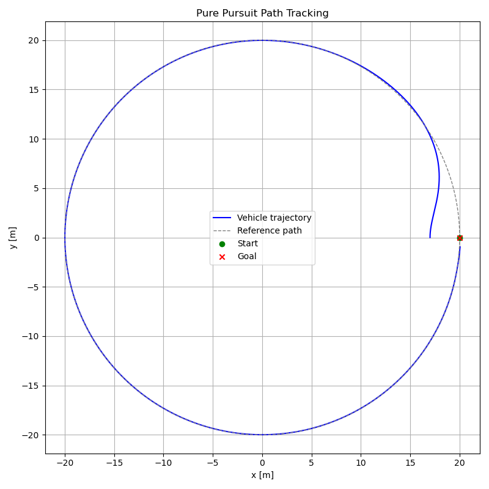
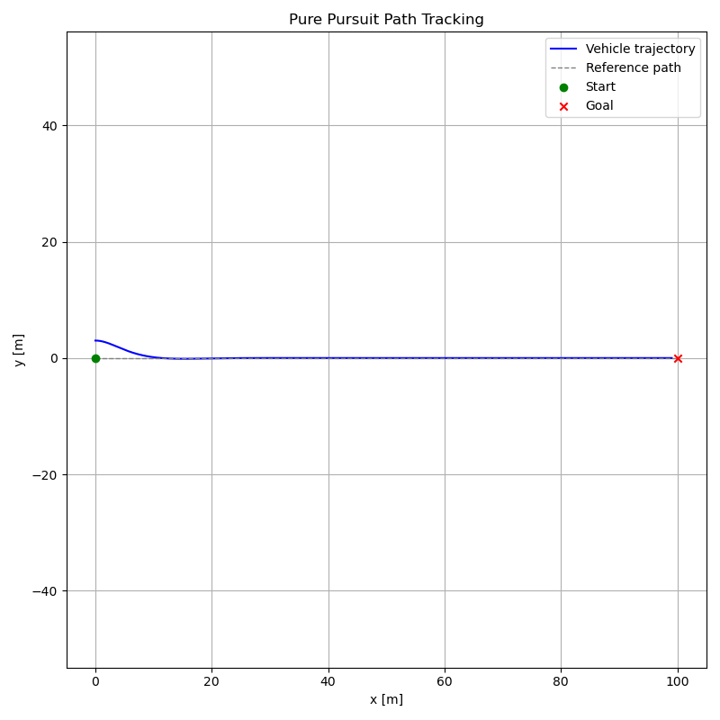

# 🏎️ Pure Pursuit Path Tracking Controller — 2D Simulation


## 📖 Overview

A **from-scratch** implementation of the **Pure Pursuit** path tracking algorithm
applied to a kinematic bicycle model. This project simulates an Ackermann-steered
vehicle following a reference trajectory in 2D.

> **No frameworks. No ROS. Pure Python + Math.**

The controller computes the steering angle required to follow a circular arc toward
a lookahead point on the reference path — demonstrating both path following and
path recovery from lateral offsets.

---

## 🎬 Results

| Circular path | Straight-line path (with offset recovery) |
|:---:|:---:|
|  |  |

---

## 🧠 Algorithm

Pure Pursuit works by:
1. Finding the **closest point** on the reference path to the vehicle
2. Selecting a **lookahead point** at distance `L` ahead along the path
3. Computing the **steering angle** δ to follow a circular arc toward that point

The core equation:

$$\delta = \arctan\left(\frac{2 \cdot L_{wb} \cdot \sin(\alpha)}{L}\right)$$

where `α` is the heading error to the lookahead point and `L_wb` is the wheelbase.

See [`docs/theory.md`](docs/theory.md) for the full mathematical derivation.

---

## 🗂️ Project Structure

    pure_pursuit_sim/
    ├── models/
    │   └── bicycle_model.py            # Kinematic bicycle model
    ├── controller/
    │   └── pure_pursuit.py             # Pure Pursuit controller
    ├── trajectory/
    │   └── path_generator.py           # Reference path generation
    ├── visualization/
    │   └── plotter.py                  # Real-time plotting
    ├── tests/                          # Unit tests
    ├── docs/
    │   └── theory.md                   # Mathematical derivation
    │   └── simulation_circle.png 
    │   └── simulation_straight.png 
    ├── main.py                         # Entry point
    ├── config.py                       # All tunable parameters
    └── requirements.txt
    └── LICENSE

---

## ⚙️ Installation

```bash
git clone https://github.com/alvarocamara08/pure_pursuit_sim.git
cd pure_pursuit_sim
pip install -r requirements.txt
```

## 🚀 Usage

```bash
python main.py
```

Adjust parameters in `config.py` — lookahead distance, vehicle speed, path type, and simulation time.

---

## 📐 Vehicle Model

The kinematic bicycle model represents an Ackermann-steered vehicle referenced at the rear axle:

$$\dot{x} = v \cdot \cos(\theta)$$

$$\dot{y} = v \cdot \sin(\theta)$$

$$\dot{\theta} = \frac{v \cdot \tan(\delta)}{L_{wb}}$$

| Parameter | Value | Description |
|-----------|-------|-------------|
| `WHEELBASE` | 2.5 m | Distance between axles |
| `LOOKAHEAD_DISTANCE` | 5.0 m | Pure Pursuit lookahead |
| `MAX_STEERING_ANGLE` | 35° | Physical steering limit |

---

## 🔭 Roadmap

- [x] Kinematic bicycle model
- [x] Pure Pursuit controller
- [x] Circular and straight-line paths
- [ ] Real-time animation
- [ ] Path disturbance and recovery demo
- [ ] Sinusoidal / figure-8 paths
- [ ] Unit tests
- [ ] Mathematical derivation (`theory.md`)

---

## 📄 License

This project is licensed under the MIT License — see [LICENSE](LICENSE) for details.